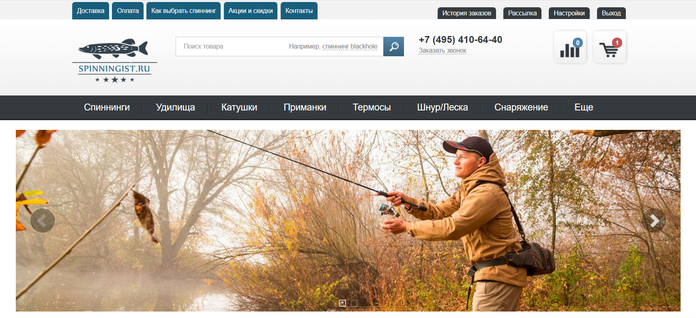

## Test project. UI and API tests. Site 'Spinningist.ru'  
   
> A website for the sale of goods for fishermen and tourists.  
> [site SPINNINGIST.RU](https://spinningist.ru/)  

### Project used:  
<p  align="left">
<code></code>
<code></code>
<code></code>
<code></code>
<code></code>
<code></code>  
<code></code>   
<code></code>  

---- 


#### Checks list:  
##### UI tests  
- [x] authorization registered user
- [x] authorization unregistered user  
- [x] test delivery manu
- [x] test payment menu
- [x] select spinning  
- [x] add spinning to cart
- [x] create order  

##### API tests  
---- 

###  Local start UI and API tests  
1) Download project and open in IDE
2) Create file `.env` and add dates for tests. Examples dates in file `.env.examples`
3) Execute command:

```commandline
pytest 
```  
4) Execute the requests to generate allure report.  
   note: command for Windows

```commandline
allure serve
```  

###  Allure report  
Special detail report with all steps, screenshots, logs.  


###  Получение уведомлений о прохождении тестов в Telegram  
Special report about tests in Telegramm.  